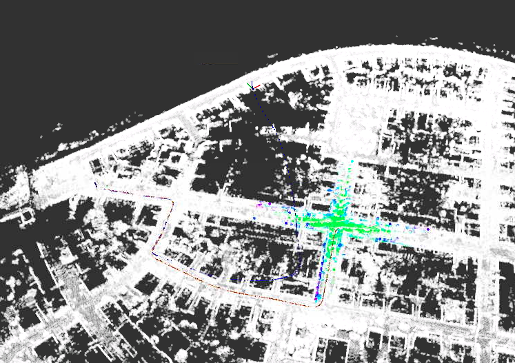
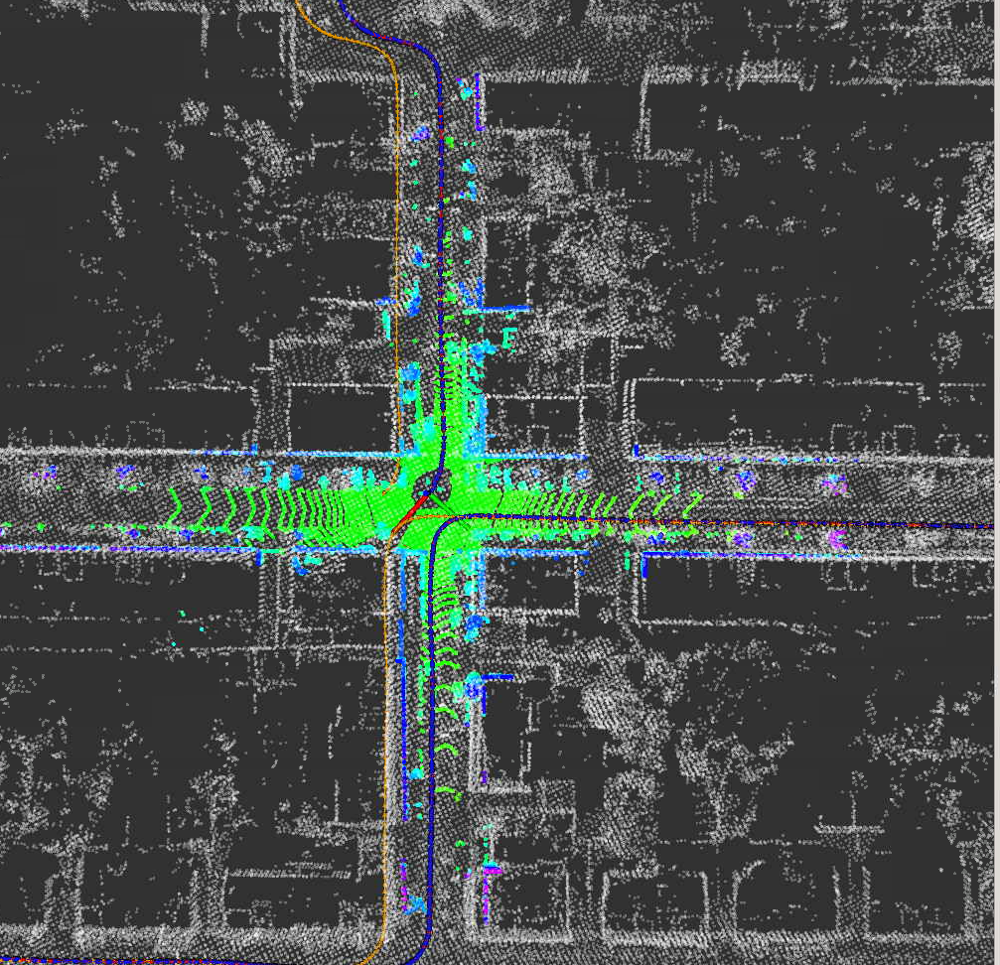

### 题目1 补全ESKF代码
原代码路径发散：


kalman预测：
```cpp
X_ = F*X_; 
P_ = F*P_*F.transpose() + B*Q_*B.transpose();
```
添加观测：
```cpp
Eigen::Vector3d P_nn_obs = pose_.block<3, 1>(0, 3) - T_nb.block<3,1>(0,3);   
Eigen::Matrix3d C_bb_obs = T_nb.block<3, 3>(0,0).transpose() * pose_.block<3, 3>(0, 0); 
```
修正状态估计：
```cpp
// a. position:
pose_.block<3, 1>(0, 3) -= X_.block<3, 1>(INDEX_ERROR_POS, 0);
// b. velocity:
vel_ -= X_.block<3, 1>(INDEX_ERROR_VEL, 0);
// c. orientation:
Eigen::Matrix3d C_bb = Eigen::Matrix3d::Identity() - Sophus::SO3d::hat( X_.block<3, 1>(INDEX_ERROR_ORI, 0) ).matrix();
pose_.block<3, 3>(0, 0) *= C_bb;
```
效果：
