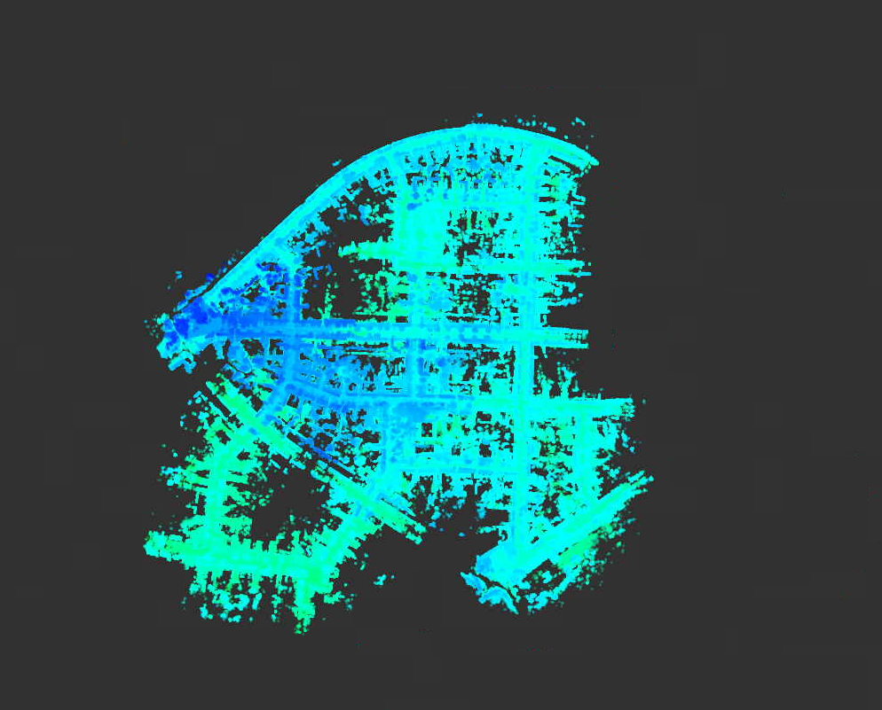

### 题目1 补全代码
IMU预积分的实现：
```cpp
    //
    // TODO: a. update mean:
    //
    // 1. get w_mid:
    w_mid = 0.5 * ( prev_w+curr_w );

    // 2. update relative orientation, so3:
    prev_theta_ij = state.theta_ij_;
    d_theta_ij =Sophus::SO3d::exp(w_mid*T) ;
    curr_theta_ij = prev_theta_ij * d_theta_ij;
    state.theta_ij_ = curr_theta_ij;

    // 3. get a_mid:
    a_mid = 0.5*(prev_theta_ij*prev_a + curr_theta_ij*curr_a);

    // 4. update relative translation:
    state.alpha_ij_ = state.alpha_ij_ + state.beta_ij_*T + 0.5*a_mid*T*T;
     
    // 5. update relative velocity:
     state.beta_ij_ = state.beta_ij_ + a_mid*T;

    //
    // TODO: b. update covariance:
    //
    // 1. intermediate results:
    dR_inv = d_theta_ij.inverse().matrix();
    prev_R = prev_theta_ij.matrix();
    curr_R = curr_theta_ij.matrix();
    prev_R_a_hat = prev_R * Sophus::SO3d::hat(a_mid);
    curr_R_a_hat = curr_R * Sophus::SO3d::hat(a_mid);
```
```cpp
    //
    // TODO: 2. set up F:
    //
    //F12 & F13 & F14 & F15
    F_.block<3, 3>(INDEX_ALPHA,  INDEX_THETA) = -0.25*T*T *( prev_R_a_hat + curr_R_a_hat*dR_inv ) ;
    F_.block<3, 3>(INDEX_ALPHA,  INDEX_BETA) =  T * Eigen::Matrix3d::Identity();
    F_.block<3, 3>(INDEX_ALPHA,  INDEX_B_A) =  -0.25*T*T*( prev_R + curr_R );
    F_.block<3, 3>(INDEX_ALPHA,  INDEX_B_G) =  0.25*T*T*T*curr_R_a_hat;

    //F22 & F25
    F_.block<3, 3>(INDEX_THETA,  INDEX_THETA) = -Sophus::SO3d::hat(w_mid*T);
    F_.block<3, 3>(INDEX_THETA,  INDEX_B_G) = -T * Eigen::Matrix3d::Identity();

    //F32 & F34 & F35
    F_.block<3, 3>(INDEX_BETA,  INDEX_THETA) =  -0.5*T *( prev_R_a_hat + curr_R_a_hat*dR_inv ) ;
    F_.block<3, 3>(INDEX_BETA,   INDEX_B_A) =  -0.5*T*( prev_R + curr_R );
    F_.block<3, 3>(INDEX_BETA,   INDEX_B_G) = 0.5*T*T*curr_R_a_hat;

    MatrixF F = Eigen::Matrix<double, DIM_STATE, DIM_STATE>::Identity() + F_;

    //
    // TODO: 3. set up G:
    //
    //G11 & G12 & G13 & G14
    B_.block<3, 3>(INDEX_ALPHA, INDEX_M_ACC_PREV) = 0.25*T*T*prev_R;
    B_.block<3, 3>(INDEX_ALPHA, INDEX_M_GYR_PREV) = B_.block<3, 3>(INDEX_ALPHA, INDEX_M_GYR_CURR) = -0.125*T*T*T*curr_R_a_hat;
    B_.block<3, 3>(INDEX_ALPHA, INDEX_M_ACC_CURR) = 0.25*T*T*curr_R;
      
    //G22 & G24
    B_.block<3, 3>(INDEX_THETA, INDEX_M_GYR_PREV) = B_.block<3, 3>(INDEX_THETA, INDEX_M_GYR_CURR) = 0.5*T * Eigen::Matrix3d::Identity();

    //G31 & G32 & G33 & G34
    B_.block<3, 3>(INDEX_BETA, INDEX_M_ACC_PREV) = 0.5*T*prev_R;
    B_.block<3, 3>(INDEX_BETA, INDEX_M_GYR_PREV) = B_.block<3, 3>(INDEX_BETA, INDEX_M_GYR_CURR) = -0.25*T*T*curr_R_a_hat;
    B_.block<3, 3>(INDEX_BETA, INDEX_M_ACC_CURR) = 0.5*T*curr_R;

    //G45 & G56
    B_.block<3, 3>(INDEX_B_A, INDEX_R_ACC_PREV) = B_.block<3, 3>(INDEX_B_G, INDEX_R_GYR_PREV) = T * Eigen::Matrix3d::Identity();

    MatrixB B = B_;

    // TODO: 4. update P_:
    P_ = F * P_ * F.transpose() + B * Q_ *B.transpose();

    // 
    // TODO: 5. update Jacobian:
    //
    J_ = F*J_;
```
修改vetex和edge的更新代码：
```cpp
// TODO: update pre-integration measurement caused by bias change:
// 
if( v0->isUpdated() ){
    Eigen::Vector3d d_b_a_i, d_b_g_i;
    v0->getDeltaBiases( d_b_a_i, d_b_g_i );
    updateMeasurement( d_b_a_i, d_b_g_i );
}
//
// TODO: compute error:
//
_error.block<3, 1>(INDEX_P, 0) = ori_i.inverse() * (pos_j -pos_i - vel_i*T_ + 0.5*g_*T_*T_) - _measurement.block<3, 1>(INDEX_P, 0);
_error.block<3, 1>(INDEX_R, 0) = ( Sophus::SO3d::exp( _measurement.block<3, 1>(INDEX_R, 0) ).inverse() * ori_i.inverse() *ori_j ).log();
_error.block<3, 1>(INDEX_V, 0) = ori_i.inverse() * (vel_j - vel_i + g_*T_) - _measurement.block<3, 1>(INDEX_V, 0);
_error.block<3, 1>(INDEX_A, 0) = b_a_j - b_a_i;
_error.block<3, 1>(INDEX_G, 0) = b_g_j - b_g_i;

```

```cpp
virtual void oplusImpl(const double *update) override {
    //
    // TODO: do update
    //
    PRVAG delta = PRVAG(update); 
    _estimate.pos += delta.pos;
    _estimate.ori  *= delta.ori;
    _estimate.vel   += delta.vel ;
    _estimate.b_a += delta.b_a;
    _estimate.b_g += delta.b_g ;

    updateDeltaBiases(delta.b_a, delta.b_g);
}
```

结果:
