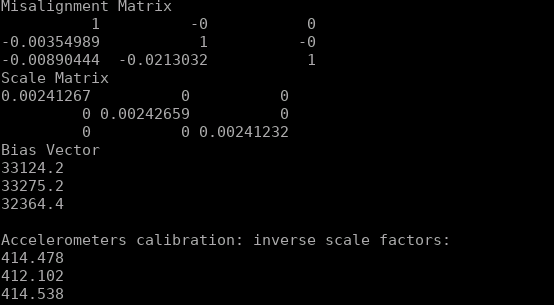
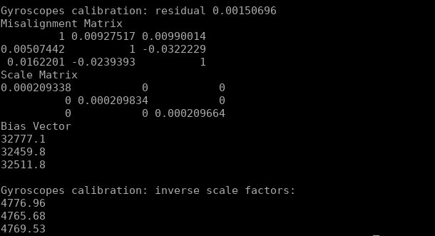

### 题目1 雅可比推导
加速度计损失函数：
$$L(\theta^{acc}) = \sum_{k=1}^M(||g||^2-||h(a_k^S,\theta^{acc})||^2)^2$$

加速度计内参：
$$\theta^{acc} = [\alpha_{yx},\alpha_{zx},\alpha_{zy},s_x^a,s_y^a,s_z^a,b_x^a,b_y^a,b_z^a]$$

下三角模型的坐标系转换矩阵为:
$$
T^a=\begin{bmatrix}
    1 &0&0\\
    \alpha_{yx} & 1& 0\\
    \alpha_{zx}&\alpha_{zy}&1
\end{bmatrix}
$$
此时，
$$h(a_k^S,\theta^{acc}) = T^aK^a(a^S+b^a) = \begin{bmatrix}
    s_x^a(a_x^s+b_x^a)\\
    \alpha_{yx}s_x^a(a_x^s+b_x^a)+s_y^a(a_y^s+b_y^a)\\
    \alpha_{zx}s_x^a(a_x^s+b_x^a)+\alpha_{zy}s_y^a(a_y^s+b_y^a)+s_z^a(a_z^s+b_z^a)
\end{bmatrix}$$
所以：
$$\frac{\partial h(a^S_k,\theta^{acc})}{\partial \theta^{acc}} = \begin{bmatrix}
    0&0&0&a_x^s+b_x^a&0&0&s_x^a&0&0\\
    s_x^a(a_x^s+b_x^a)&0&0&\alpha_{yz}(a_x^s+b_x^a)&a_y^s+b_y^a&0&\alpha_{yz}s_x^a&s_y^a&0\\
    0&s_x^a(a_x^s+b_x^a)&s_y^a(a_y^s+b_y^a)&\alpha_{zy}(a_x^s+b_x^a)&\alpha_{zx}(a_y^s+b_y^a)&a_z^s+b_z^a&\alpha_{zy}s_x^a&\alpha_{zx}s_y^a&s_z^a
\end{bmatrix}$$

$\frac{\partial L(\theta^{acc})}{\partial \theta^{acc}} = 4h(a^S_k,\theta^{acc})^3\frac{\partial h(a^S_k,\theta^{acc})}{\partial \theta^{acc}}-4||g||^2\frac{\partial h(a^S_k,\theta^{acc})}{\partial \theta^{acc}} $

### 题目2 数值求导
修改为下三角模型：
```cpp
    CalibratedTriad_<_T2> calib_triad( 
      // mis_yz, mis_zy, mis_zx:
      _T2(0), _T2(0), _T2(0),
      // mis_xz, mis_xy, mis_yx:
      params[0], params[1], params[2],

      //    s_x,    s_y,    s_z:
      params[3], params[4], params[5], 
      //    b_x,    b_y,    b_z: 
      params[6], params[7], params[8] 
    );
```

```cpp
acc_calib_params[0] = init_acc_calib_.misXZ();
acc_calib_params[1] = init_acc_calib_.misXY();
acc_calib_params[2] = init_acc_calib_.misYX();
```
```cpp
0,0,0,
min_cost_calib_params[0],
min_cost_calib_params[1],
min_cost_calib_params[2],
```
结果：
加速度计内参：

陀螺仪内参：

### 题目三 解析求导