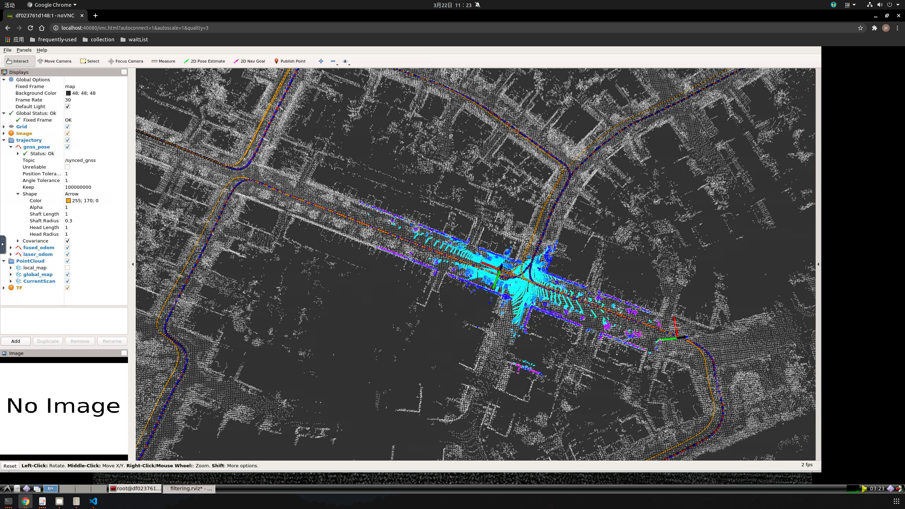

### 题目1 补全代码

添加观测类型
```cpp
enum MeasurementType {
    POSE = 0,
    POSE_VEL,
    POSI,
    POSI_VEL,
    POSI_MAG,
    POSI_VEL_MAG,
    POSE_CONSTRAINT,
    NUM_TYPES
  };
```

添加处理函数：
```cpp
switch (measurement_type) {
    case MeasurementType::POSE:
        CorrectErrorEstimationPose(measurement.T_nb, Y, G, K);
        break;
    case MeasurementType::POSE_CONSTRAINT:
        CorrectErrorEstimationPoseWithMotionConstraint(measurement.T_nb, Y, G, K);
        break;
    default:
        break;
}
```
计算卡尔曼增益：
```cpp
void ErrorStateKalmanFilter::CorrectErrorEstimationPoseWithMotionConstraint(
    const Eigen::Matrix4d &T_nb,
    Eigen::VectorXd &Y, 
    Eigen::MatrixXd &G,
    Eigen::MatrixXd &K) {

  //
  // TODO: set measurement:
  //
  Eigen::Vector3d P_nn_obs = T_nb.block<3, 1>(0, 3); 
  Eigen::Vector3d R_nn_obs = Eigen::Vector3d::Identity(); 
  // measurement
  Eigen::Matrix3d R_nb = T_nb.block<3, 3>(0, 0);
  // predict
  Eigen::Matrix3d R_nb_predict = pose_.block<3, 3>(0, 0);
  Eigen::Matrix3d delta_R = R_nb.transpose() * R_nb_predict;
  R_nn_obs = Sophus::SO3d::vee(delta_R - Eigen::Matrix3d::Identity());
  Eigen::Vector3d p_predict = pose_.block<3, 1>(0, 3);

  Eigen::Matrix<double, 8, 1> Y_pose_constraint;
  Y_pose_constraint.block<3, 1>(0, 0) = p_predict - P_nn_obs;
  Y_pose_constraint.block<3, 1>(6, 0) = R_nn_obs;
  Y_pose_constraint.block<2, 1>(3, 0) = Eigen::Vector2d(0.0, 0.0);


  Y = Y_pose_constraint;
  // MOTION_CONSTRAINT
  if (MOTION_CONSTRAINT.ACTIVATED) {
    GPoseVelCons_.block<2, 3>(3, 3) = R_nb_predict.transpose().block<2, 3>(0, 0);

  } else {

    G = GPose_;
  }
  //
  // TODO: set Kalman gain:
  //
  MatrixRPose R = RPoseVel_; // fix this
  K = P_ * G.transpose() * ((G * P_ * G.transpose() + CPoseVelCons_ * R * CPoseVelCons_.transpose()).inverse());      
}
```
在GetQPose函数中，修改：
```cpp
 //Y.block<DIM_MEASUREMENT_POSE, 1>(0, 0) = YPose_;
 Y.block<DIM_MEASUREMENT_POSE, 1>(0, 0) = YPoseVel_;
// Y.block<DIM_MEASUREMENT_POSE, 1>(i * DIM_MEASUREMENT_POSE, 0) = YPose_;
 Y.block<DIM_MEASUREMENT_POSE, 1>(i * DIM_MEASUREMENT_POSE, 0) = YPoseVel_;
```
效果：
