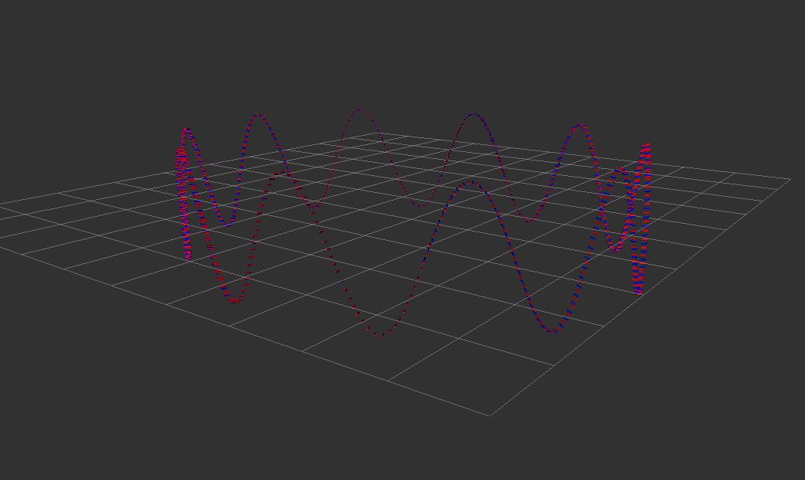
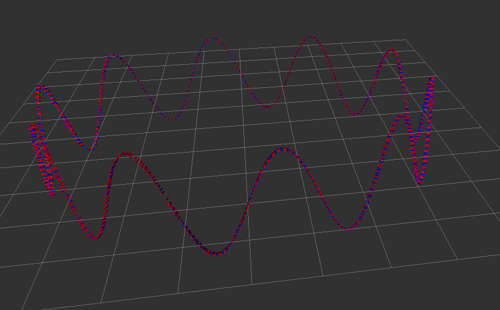

### 题目1 中值积分的实现
```cpp
const size_t index_current = 1;
const size_t index_previous = 0;
Eigen::Vector3d angular_delta;
Eigen::Vector3d velocity_delta;
Eigen::Matrix3d R_curr;
Eigen::Matrix3d R_prev;
double delta_t;

GetAngularDelta(index_current, index_previous, angular_delta);

// update orientation:
UpdateOrientation(
    angular_delta,
    R_curr, R_prev);

// get velocity delta:
GetVelocityDelta(
    index_current, index_previous,
    R_curr, R_prev,
    delta_t, velocity_delta);

// update position:
UpdatePosition(delta_t, velocity_delta);
imu_data_buff_.pop_front();
```

结果：


### 题目2 实现欧拉积分并与中值积分结果比较
后向欧拉法结果：



比较：
