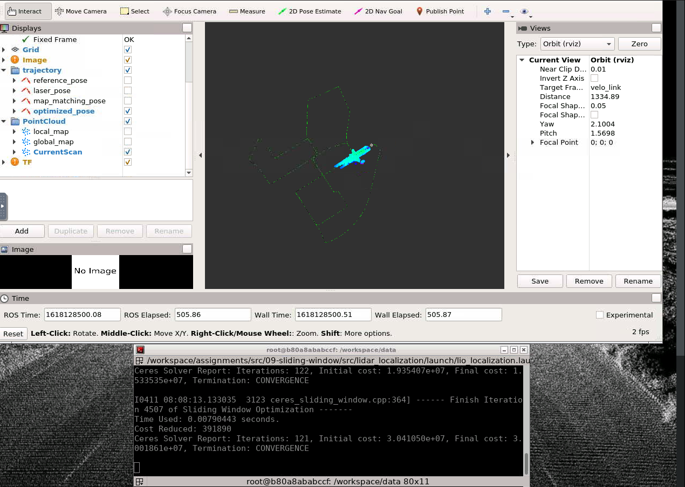

### 题目1 补全代码
IMU预积分的残差及雅可比矩阵：
```cpp
//
// TODO: get square root of information matrix:
//
    Eigen::Matrix<double, 15, 15> sqrt_info = Eigen::LLT<Eigen::Matrix<double, 15, 15>>
                                                (I_).matrixL().transpose();
//
// TODO: compute residual:
//
    Eigen::Map<Eigen::Matrix<double, 15, 1>> residual(residuals);

    residual.block<3, 1>(0, 0) = ori_i.inverse() * (pos_j - pos_i - (vel_i -
                                     0.5 * g_ * T_) * T_) - alpha_ij;
    residual.block<3, 1>(3, 0) = (Sophus::SO3d::exp(theta_ij).inverse() * 
                                    ori_i.inverse() * ori_j).log();
    residual.block<3, 1>(6, 0) = ori_i.inverse() * (vel_j - vel_i + g_ * T_) - beta_ij;
    residual.block<3, 1>(9, 0) = b_a_j - b_a_i;
    residual.block<3, 1>(12, 0) = b_g_j - b_g_i;
//
// TODO: compute jacobians:
//
if ( jacobians ) {
    // compute shared intermediate results:
    const Eigen::Matrix3d R_i_inv = ori_i.inverse().matrix();
    const Eigen::Matrix3d J_r_inv = JacobianRInv(residual.block(3, 0, 3, 1));
    if ( jacobians[0] ) {
    Eigen::Map<Eigen::Matrix<double, 15, 15, Eigen::RowMajor>> jacobian_i( jacobians[0] );
    jacobian_i.setZero();
    // a. residual, position:
    jacobian_i.block<3, 3>(0, 0) = -R_i_inv;
    jacobian_i.block<3, 3>(0, 3) = Sophus::SO3d::hat(ori_i.inverse() * (pos_j -
         pos_i - (vel_i - 0.5 * g_ * T_) * T_));
    jacobian_i.block<3, 3>(0, 6) = - T_ * R_i_inv;
    jacobian_i.block<3, 3>(0, 9) = -J_.block<3, 3>(0, 9);
    jacobian_i.block<3 ,3>(0, 12) = -J_.block<3, 3>(0, 12);
```
```cpp
    // b. residual, orientation:
    jacobian_i.block<3, 3>(3, 3) = -J_r_inv * (ori_j.inverse() * ori_i).matrix();
    jacobian_i.block<3, 3>(3, 12) = -J_r_inv * (Sophus::SO3d::exp(residual.block<3, 1>
                                    (3, 0))).matrix().inverse() * J_.block<3, 3>(3, 12);
    // c. residual, velocity:
    jacobian_i.block<3, 3>(6, 3) = Sophus::SO3d::hat(ori_i.inverse() * (vel_j - vel_i + g_ * T_));
    jacobian_i.block<3, 3>(6, 6) = -R_i_inv;
    jacobian_i.block<3, 3>(6, 9) = -J_.block<3, 3>(6, 9);
    jacobian_i.block<3, 3>(6, 12) = -J_.block<3, 3>(6, 12);
    // d. residual, bias accel:
    jacobian_i.block<3, 3>(9, 9) = -Eigen::Matrix3d::Identity();
    // d. residual, bias accel:
    jacobian_i.block<3, 3>(12, 12) = -Eigen::Matrix3d::Identity();

    jacobian_i = sqrt_info * jacobian_i;
    }

    if ( jacobians[1] ) {
    Eigen::Map<Eigen::Matrix<double, 15, 15, Eigen::RowMajor>> jacobian_j(jacobians[1]);
    jacobian_j.setZero();
    // a. residual, position:
    jacobian_j.block<3, 3>(0, 0) = R_i_inv;
    // b. residual, orientation:
    jacobian_j.block<3, 3>(3, 3) = J_r_inv;
    // c. residual, velocity:
    jacobian_j.block<3, 3>(6, 6) = R_i_inv;
    // d. residual, bias accel:
    jacobian_j.block<3, 3>(9, 9) = Eigen::Matrix3d::Identity();
    // d. residual, bias accel: 
    jacobian_j.block<3, 3>(12, 12) = Eigen::Matrix3d::Identity();
    jacobian_j = sqrt_info * jacobian_j;
    }
    }

    //
    // TODO: correct residual by square root of information matrix:
    //
    residual = sqrt_info * residual;
    return true;
```
回环的残差和雅可比：
```cpp
    //
    // TODO: get square root of information matrix:
    //
    Eigen::Matrix<double, 6, 6> sqrt_info = Eigen::LLT<Eigen::Matrix<double, 6, 6>>
                                            (I_).matrixL().transpose();
    //
    // TODO: compute residual:
    //
    Eigen::Map<Eigen::Matrix<double, 6, 1>> residual(residuals);
    residual.block<3, 1>(0, 0) = pos - pos_prior;
    residual.block<3, 1>(3, 0) = (ori * ori_prior.inverse()).log();
    //
    // TODO: compute jacobians:
    //
    if ( jacobians ) {
      if ( jacobians[0] ) {
        // implement jacobian computing:
        Eigen::Map<Eigen::Matrix<double, 6, 15, Eigen::RowMajor> > jacobian_prior( jacobians[0] );
        jacobian_prior.setZero();

        jacobian_prior.block<3, 3>(0, 0) = Eigen::Matrix3d::Identity();
        jacobian_prior.block<3, 3>(3, 3) = JacobianRInv(residual.block(0, 0, 3, 1))*ori_prior.matrix();

        jacobian_prior = sqrt_info * jacobian_prior;
      }
    }

    //
    // TODO: correct residual by square root of information matrix:
    //
		residual = sqrt_info * residual;
    return true;
```
前端lidar里程计的残差和雅可比：
```cpp
    //
    // TODO: get square root of information matrix:
    //
    Eigen::Matrix<double, 6, 6> sqrt_info = Eigen::LLT<Eigen::Matrix<double, 6, 6>>
                                                (I_).matrixL().transpose();

    //
    // TODO: compute residual:
    //
    Eigen::Map<Eigen::Matrix<double, 6, 1>> residual(residuals);

    residual.block<3, 1>(0, 0) = ori_i.inverse() * (pos_j - pos_i) - pos_ij;
    residual.block<3, 1>(3, 0) = (ori_i.inverse() * ori_j * ori_ij.inverse()).log();
    //
    // TODO: compute jacobians:
    //
    if ( jacobians ) {
      // compute shared intermediate results:
     const Eigen::Matrix3d R_i_inv = ori_i.inverse().matrix();
      const Eigen::Matrix3d J_r_inv = JacobianRInv(residual.block<3, 1>(3, 0));
      if ( jacobians[0] ) {
        // implement computing:
        Eigen::Map<Eigen::Matrix<double, 6, 15, Eigen::RowMajor>> jacobian_i(jacobians[0]);
        jacobian_i.setZero();

        jacobian_i.block<3, 3>(0, 0) = -R_i_inv;
        jacobian_i.block<3, 3>(3, 3) = -J_r_inv * (ori_ij * ori_j.inverse() * ori_i).matrix();

        jacobian_i = sqrt_info * jacobian_i;
      }

      if ( jacobians[1] ) {
        // implement computing:
        Eigen::Map<Eigen::Matrix<double, 6, 15, Eigen::RowMajor>> jacobian_j(jacobians[1]);
        jacobian_j.setZero();

        jacobian_j.block<3, 3>(0, 0) = R_i_inv;
        jacobian_j.block<3, 3>(3, 3) = J_r_inv * ori_ij.matrix();

        jacobian_j = sqrt_info * jacobian_j;
      }
    }

    //
    // TODO: correct residual by square root of information matrix:
    //
    residual = sqrt_info * residual;
    return true;
```
边缘化的实现：
```cpp
  void Marginalize(
    const double *raw_param_r_0
  ) {
    // TODO: implement marginalization logic
    Eigen::Map<const Eigen::Matrix<double, 15, 1>> x_0(raw_param_r_0);
    x_0_ = x_0;

    Eigen::MatrixXd H_mm = H_.block<15, 15>(0, 0);
    Eigen::MatrixXd H_mr = H_.block<15, 15>(0, 15);
    Eigen::MatrixXd H_rm = H_.block<15, 15>(15, 0);
    Eigen::MatrixXd H_rr = H_.block<15, 15>(15, 15);

    Eigen::VectorXd b_m = b_.block<15, 1>(0, 0);
    Eigen::VectorXd b_r = b_.block<15, 1>(15, 0);

    Eigen::MatrixXd H_mm_inv = H_mm.inverse();
    Eigen::MatrixXd H_marginalized = H_rr - H_rm * H_mm_inv * H_mr;
    Eigen::MatrixXd b_marginalized = b_r - H_rm * H_mm_inv * b_m;

    //
    // solve linearized residual & Jacobian:
    // 
    Eigen::SelfAdjointEigenSolver<Eigen::MatrixXd> saes(H_marginalized);
    Eigen::VectorXd S = Eigen::VectorXd(
      (saes.eigenvalues().array() > 1.0e-5).select(saes.eigenvalues().array(), 0)
    );
    Eigen::VectorXd S_inv = Eigen::VectorXd(
      (saes.eigenvalues().array() > 1.0e-5).select(saes.eigenvalues().array().inverse(), 0)
    );

    Eigen::VectorXd S_sqrt = S.cwiseSqrt();
    Eigen::VectorXd S_inv_sqrt = S_inv.cwiseSqrt();

    // finally:
    J_ = S_sqrt.asDiagonal() * saes.eigenvectors().transpose();
    e_ = S_inv_sqrt.asDiagonal() * saes.eigenvectors().transpose() * b_marginalized;
  }
```

运行结果：
