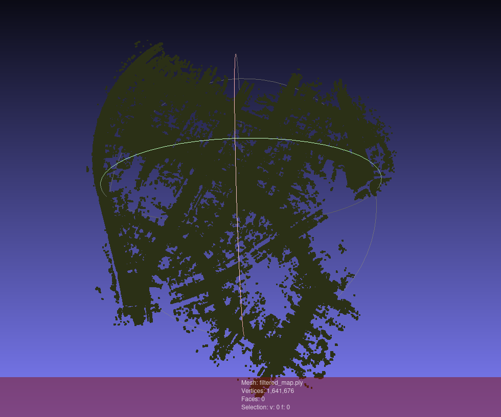
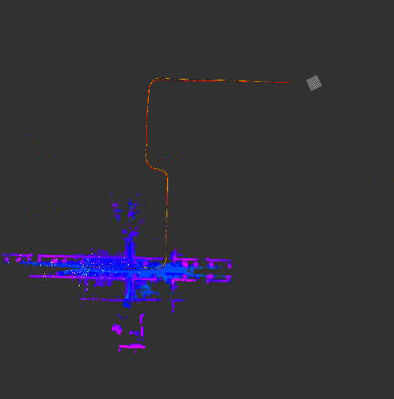
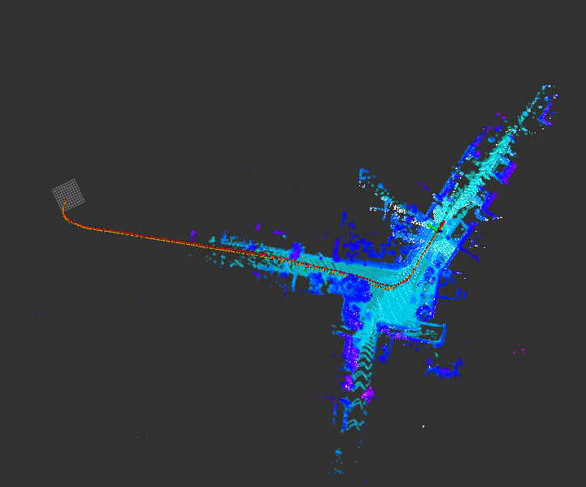
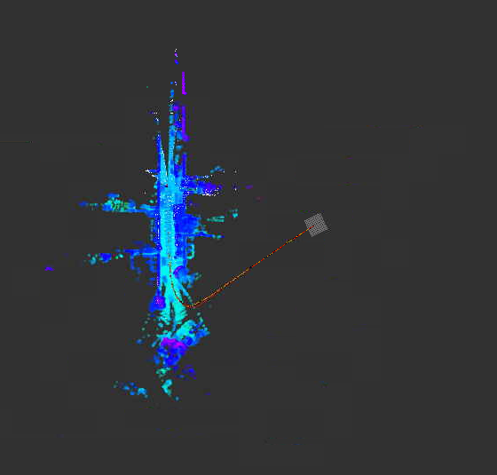
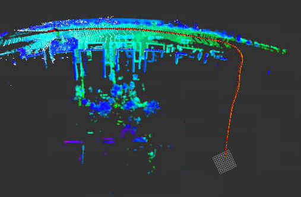

### 题目1
运行框架，保存全局地图：


### 题目2
将初始化代码修改为:
```cpp
bool MatchingFlow::UpdateMatching() {
    if (!matching_ptr_->HasInited()) {
        matching_ptr_->SetGNSSPose(current_gnss_data_.pose);
    }

    return matching_ptr_->Update(current_cloud_data_, laser_odometry_);
}
```
即直接选择gnss位姿作为初始化位姿。
100、200、300、400s处初始化截图：



